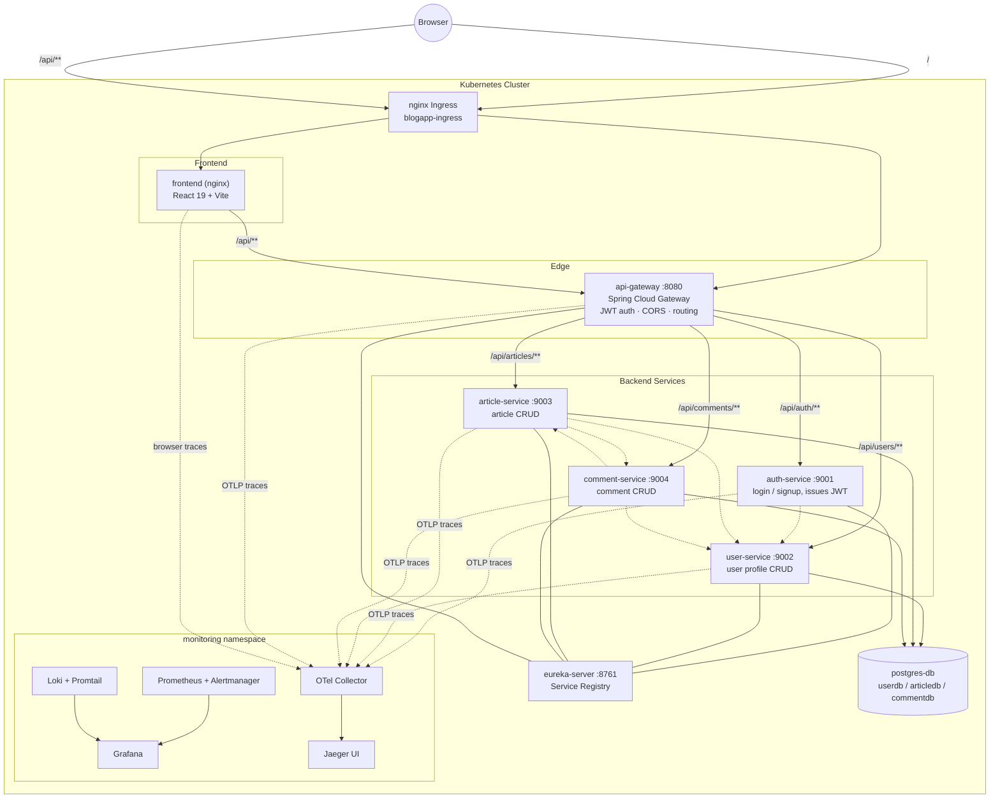
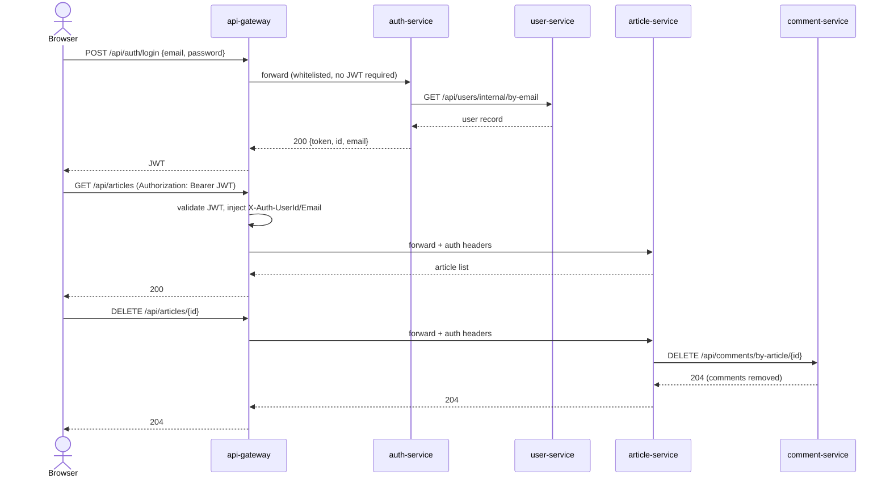

# BlogApp — Microservices Blog Platform

A microservices-based blogging application: a Spring Boot backend (API Gateway + 5 services behind Eureka discovery) and a React (Vite) frontend, built with Jenkins CI, deployed to Kubernetes via Kustomize, and observed with a full Prometheus/Loki/Jaeger stack.

## Architecture



**Notes on the diagram**
- Every service registers with **Eureka** for visibility/health, but Feign calls use **explicit static URLs** (`services.<name>.url`), not Eureka-based discovery.
- The gateway validates the JWT once and injects trust-boundary headers `X-Auth-UserId` / `X-Auth-UserEmail`; each service's `FeignAuthForwardConfig` re-forwards those headers on any further Feign call, so identity propagates through the whole chain.
- All three business databases (`userdb`, `articledb`, `commentdb`) live in a **single shared Postgres instance** (`postgres-db`), created via an init ConfigMap. Older per-service DB manifests (`article-db/`, `comment-db/`, `user-db/`) exist under `k8s-config/base/backend/` but are unused/orphaned by the current kustomization.

## Request & auth flow



## Services

| Service | Port | Responsibility | Database | Calls out to |
|---|---|---|---|---|
| `api-gateway` | 8080 | Single entry point, JWT enforcement, CORS, routing | — | all services (routing) |
| `eureka-server` | 8761 | Service registry | — | — |
| `auth-service` | 9001 | Login/signup, JWT issuance | — | `user-service` (Feign) |
| `user-service` | 9002 | User profile CRUD (source of truth for users) | `userdb` | — |
| `article-service` | 9003 | Article CRUD | `articledb` | `user-service`, `comment-service` (Feign) |
| `comment-service` | 9004 | Comment CRUD | `commentdb` | `article-service`, `user-service` (Feign) |
| `blogapp-common` | — | Shared library: JWT util, header constants, shared DTOs | — | — |
| `frontend` | 80 (nginx) | React 19 + Vite SPA | — | `api-gateway` only |

JWT whitelist (no token required): `/api/auth/login`, `/api/auth/signup`, `/eureka`, `/actuator`.

## Repository structure

```
backend/
  api-gateway/       Spring Cloud Gateway, JWT filter, routing, Jenkinsfile
  auth-service/       Login/signup, Feign -> user-service
  user-service/        User CRUD, Postgres (userdb)
  article-service/     Article CRUD, Postgres (articledb), Feign -> user/comment
  comment-service/    Comment CRUD, Postgres (commentdb), Feign -> article/user
  eureka-server/       Service registry
  blogapp-common/       Shared JWT util, header constants, DTOs (no Spring dep)
frontend/               React 19 + Vite SPA, nginx Dockerfile, Jenkinsfile
k8s-config/
  base/                 Base manifests (Deployments/Services/Ingress) + ArgoCD sync-wave annotations
  overlays/dev|test|production   Kustomize overlays: image tags, replicas, namespace, ingress patches
  monitoring/metrics/   Prometheus, Alertmanager, Grafana, node-exporter
  monitoring/logs/       Loki, Promtail (+ RBAC)
  monitoring/traces/     OTel Collector, Jaeger
settings.gradle           Multi-module Gradle build (7 modules)
```

## CI/CD

Each backend service and the frontend has its own `Jenkinsfile` (`git branch: main`). Deployment to the cluster is handled separately by **ArgoCD** (every backend manifest carries an `argocd.argoproj.io/sync-wave` annotation) — Jenkins only builds, tests, and pushes images; it does not `kubectl apply`.

```mermaid
flowchart LR
    A["Push to main"] --> B["Checkout code"]
    B --> C["./gradlew build<br/>(service module only)"]
    C --> D["SonarQube analysis<br/>+ Quality Gate"]
    D --> E["docker buildx build<br/>linux/amd64,arm64"]
    E --> F["Push to Docker Hub<br/>khanhduy05/&lt;service&gt;:BUILD_NUMBER"]
    F --> G["Update image tag in<br/>k8s-config overlay"]
    G --> H["ArgoCD sync"]
    H --> I["Deployed to cluster"]
```



- **Backend services** (`api-gateway`, `auth-service`, `user-service`, `article-service`, `comment-service`, `eureka-server`): Checkout → `./gradlew :backend:<service>:build` → SonarQube + Quality Gate (5 min timeout) → multi-arch `docker buildx` build & push, tagged `khanhduy05/<service>:${BUILD_NUMBER}` (plus a per-service secondary tag, several of which are leftover demo tags — worth cleaning up).
- **`blogapp-common`**: same Sonar/Quality Gate flow, but single-arch `docker build`/`tag`/`push` split into separate stages (it's a library consumed at build time, not a running workload).
- **`frontend`**: Node pipeline (`nodejs 'Node25'`) — Checkout → `npm install` → `npm run build` → single-arch `docker build`/`push`, image `khanhduy05/frontend`. No SonarQube/Quality Gate stage.
- All pipelines authenticate to Docker Hub via the `dockerhub` Jenkins credential and clean the workspace on completion.

## Kubernetes deployment (Kustomize overlays)

| Overlay | Namespace | Replicas | Notable patches |
|---|---|---|---|
| `dev` | `dev` | 1 each | Frontend Service patched to `LoadBalancer` (static IP), Ingress deleted |
| `test` | `test` | 1 each | Ingress host patched to `test.blogapp.local` |
| `production` | `production` | 1 each | Base Ingress kept as-is (catch-all host) |

Deploy manually to an overlay:

```bash
kubectl config use-context your-cluster
kubectl apply -k k8s-config/overlays/dev
```

Each backend Deployment includes a `startupProbe`/`readinessProbe`/`livenessProbe` against `/actuator/health`, and DB-backed services (`article-service`, `comment-service`, `user-service`) use a `busybox` init container that polls `postgres-db:5432` before starting.

## Observability

- **Metrics**: every Spring service exposes `/actuator/prometheus`; scraped by Prometheus, alerting via Alertmanager, visualized in Grafana (`grafana/grafana:11.1.0`).
- **Logs**: Promtail (DaemonSet) tails pod logs cluster-wide and pushes to Loki; viewable in Grafana.
- **Traces**: backend services ship traces via an OpenTelemetry Java agent; the frontend ships browser traces via OTel Web SDK through an nginx proxy path (`/v1/traces`). Both paths land on the **OTel Collector**, which exports to **Jaeger** (UI on `:16686`).

## Local development

```bash
# Backend: build all modules
./gradlew clean build

# Frontend
cd frontend
npm install
npm run dev   # dev server proxies /api -> http://api-gateway:8080
```

There is no `docker-compose.yml` in this repo — local multi-service runs are done either from the IDE (each service individually, plus a local Postgres) or by deploying the `dev` Kustomize overlay to a cluster.

## Requirements

- JDK 21, Gradle 8.x (wrapper included), Node.js (see `Jenkinsfile` for version, e.g. Node 25 in CI)
- Docker (with buildx) or Podman
- kubectl + kustomize (kubectl ≥ 1.14 has built-in kustomize support)
- Access to a Kubernetes cluster and the `khanhduy05` Docker Hub namespace (or your own registry)

## Troubleshooting

- Pipeline can't push images → verify the `dockerhub` Jenkins credential and test `docker login` manually.
- Pods not starting → `kubectl get pods -n <namespace>` / `kubectl logs <pod>`; DB-backed services will sit in `Init` until `postgres-db:5432` is reachable.
- 401s through the gateway → check the request isn't hitting the JWT whitelist by mistake, and that `jwt.secret` matches between `api-gateway` and `auth-service`.
- No traces in Jaeger → confirm `OTEL_EXPORTER_OTLP_ENDPOINT` on the pod and that the `otel-collector` Service in the `monitoring` namespace is reachable from the app namespace.
